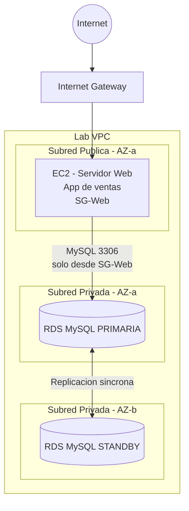
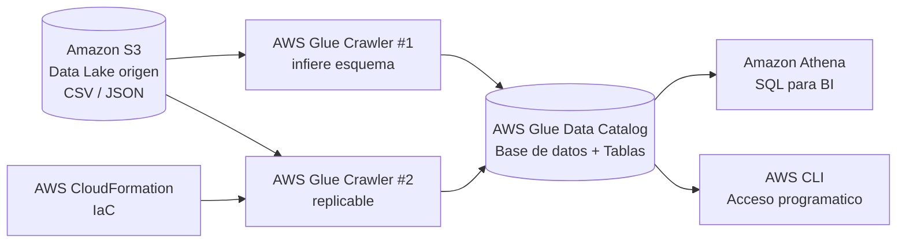

# Informe Técnico — Prueba de Concepto (PoC)

## Módulo 9: Computación en la Nube y Cloud Serverless — Tarea 1

**Diplomado en Data Engineer — 2026**

**Autor(a):** Valeria Luna
**Empresa (caso de estudio):** LatamBuy
**Fecha:** Julio 2026

---

## Índice de Contenidos

1. Resumen Ejecutivo
2. Fase 1 (OLTP): Arquitectura Transaccional y Conectividad de Aplicaciones (PoC Lab RDS)
   - 2.1 Diagrama de Arquitectura de la Fase 1
   - 2.2 Diccionario de Componentes y Funciones
   - 2.3 Evidencia de Implementación y Conectividad de la Aplicación
3. Fase 2 (OLAP): Pipeline ETL, Gobierno y Analítica Serverless (PoC Lab AWS Glue)
   - 3.1 Diagrama de Arquitectura de la Fase 2
   - 3.2 Diccionario de Componentes y Funciones
   - 3.3 Evidencia de Catalogación, Automatización (IaC) y Consultas SQL (Athena)
4. Análisis de Seguridad y Cumplimiento Analítico (Políticas IAM)
5. Conclusiones Técnicas de la PoC
6. Anexo: Prompt de Inteligencia Artificial utilizado

---

## 1. Resumen Ejecutivo

La cadena minorista internacional **LatamBuy** enfrenta dos problemas críticos en su sucursal regional. En el plano operativo, su aplicación web de registro de ventas opera sobre una base de datos local desactualizada, lo que provoca caídas continuas del servicio y pérdida de transacciones. En el plano analítico, el equipo de Business Intelligence (BI) no logra generar reportes de rendimiento porque el historial de compras se encuentra disperso en archivos planos dentro de un repositorio de almacenamiento, sin un esquema ni un catálogo que permita consultarlo.

Esta Prueba de Concepto (PoC) resuelve el problema de punta a punta mediante dos hitos tecnológicos claramente diferenciados, alineados con las cargas de trabajo OLTP y OLAP:

- **Fase 1 — Transaccional (OLTP):** se migra la base de datos de la aplicación a **Amazon RDS** con una implementación **Multi-AZ**, garantizando alta disponibilidad y tolerancia a fallos. La instancia se aísla en subredes privadas y se protege con Grupos de Seguridad configurados bajo el principio de menor privilegio, permitiendo tráfico únicamente desde el servidor web de la aplicación. El objetivo es sostener la operación diaria (escritura y lectura de ventas) sin interrupciones ante fallas de infraestructura.

- **Fase 2 — Analítica (OLAP):** se construye un pipeline **completamente Serverless** que descubre, cataloga y consulta el histórico de datos masivos. Un **AWS Glue Crawler** infiere automáticamente el esquema de los archivos en Amazon S3 y lo publica en el **AWS Glue Data Catalog**; el segundo crawler se despliega como **Infraestructura como Código (AWS CloudFormation)** para hacer el pipeline replicable en otros países; y **Amazon Athena** habilita consultas SQL interactivas para el equipo de BI, sin administrar servidores. El objetivo es transformar datos crudos y dispersos en información gobernada, segura y consultable bajo demanda.

En conjunto, la solución separa la carga transaccional de la analítica, elimina los puntos únicos de falla, reduce costos operativos gracias al modelo serverless y al almacenamiento columnar (Parquet), y aplica controles de seguridad IAM de menor privilegio en todas las capas.

---

## 2. Fase 1 (OLTP): Arquitectura Transaccional y Conectividad de Aplicaciones (PoC Lab RDS)

> **Laboratorio de referencia:** *Ejercicio de laboratorio 5 – Creación de un servidor de bases de datos* — AWS Academy Cloud Foundations [177761].

### 2.1 Diagrama de Arquitectura de la Fase 1

La arquitectura implementa el aislamiento de red exigido: el servidor web reside en una **subred pública** (accesible desde Internet) y la base de datos administrada reside en **subredes privadas** distribuidas en dos Zonas de Disponibilidad (Multi-AZ). El acceso a la base de datos solo se permite desde el Grupo de Seguridad del servidor web, en el puerto nativo del motor MySQL (3306).

```
                                Internet
                                    │
                                    ▼
                        ┌───────────────────────┐
                        │   Internet Gateway     │
                        └───────────┬───────────┘
                                    │
     ┌──────────────────────────────────────────────────────────┐
     │  VPC (Lab VPC)                                            │
     │                                                          │
     │   ┌───────────────────────────────────────────────┐     │
     │   │ Subred PÚBLICA  (AZ-a)                         │     │
     │   │   ┌───────────────────────────────────────┐   │     │
     │   │   │  EC2 - Servidor Web de la Aplicación   │   │     │
     │   │   │  (App de registro de ventas)           │   │     │
     │   │   │  SG-Web: entrada 80/22 desde Internet  │   │     │
     │   │   └──────────────────┬────────────────────┘   │     │
     │   └──────────────────────┼────────────────────────┘     │
     │                          │  MySQL 3306                   │
     │                          │  (solo desde SG-Web)          │
     │            ┌─────────────▼──────────────┐                │
     │            │   DB Subnet Group          │                │
     │   ┌────────┴─────────┐        ┌─────────┴────────┐       │
     │   │ Subred PRIVADA   │        │ Subred PRIVADA   │       │
     │   │ (AZ-a)           │        │ (AZ-b)           │       │
     │   │  ┌────────────┐  │  sync  │  ┌────────────┐  │       │
     │   │  │ RDS MySQL  │◄─┼────────┼─►│ RDS MySQL  │  │       │
     │   │  │ PRIMARIA   │  │        │  │  STANDBY   │  │       │
     │   │  └────────────┘  │        │  └────────────┘  │       │
     │   │  SG-RDS: entrada 3306 solo desde SG-Web      │       │
     │   └──────────────────┘        └──────────────────┘       │
     │                     Amazon RDS Multi-AZ                  │
     └──────────────────────────────────────────────────────────┘
```

*Diagrama equivalente en Mermaid (opcional, para renderizar en la conversión a PDF):*



> `[INSERTAR CAPTURA: diagrama de arquitectura final. Puede ser este esquema exportado o uno elaborado en draw.io / Lucidchart mostrando EC2 pública + RDS Multi-AZ privada.]`

### 2.2 Diccionario de Componentes y Funciones

| Componente | Servicio AWS | Función en la arquitectura |
|---|---|---|
| **VPC (Lab VPC)** | Amazon VPC | Red virtual aislada que contiene todos los recursos de la Fase 1 y define el límite de confianza. |
| **Subred pública** | Amazon VPC Subnet | Aloja el servidor web; tiene ruta hacia el Internet Gateway para recibir tráfico de los clientes. |
| **Subredes privadas (x2)** | Amazon VPC Subnet | Alojan las instancias de base de datos en dos AZ distintas; **no** tienen ruta directa a Internet. |
| **Internet Gateway** | Amazon VPC IGW | Permite la comunicación entre la subred pública y el exterior (usuarios de la tienda web). |
| **Servidor Web** | Amazon EC2 | Ejecuta la aplicación de registro de ventas; es el **único** origen autorizado para conectarse a la base de datos. |
| **Base de datos** | Amazon RDS (MySQL) | Motor relacional administrado que persiste las transacciones de ventas. Configurado en **Multi-AZ**. |
| **Instancia Standby** | Amazon RDS Multi-AZ | Réplica síncrona en otra AZ; asume automáticamente el rol primario (failover) ante una falla, garantizando alta disponibilidad. |
| **DB Subnet Group** | Amazon RDS | Agrupa las subredes privadas de ambas AZ para que RDS pueda ubicar las instancias primaria y standby. |
| **SG-Web** | Security Group | Permite tráfico entrante HTTP (80) y SSH (22) desde Internet hacia el servidor web. |
| **SG-RDS** | Security Group | Permite tráfico entrante **solo** en el puerto 3306 (MySQL) y **solo** desde el SG-Web (menor privilegio). Deniega el acceso público. |

### 2.3 Evidencia de Implementación y Conectividad de la Aplicación

**a) Resultado del laboratorio (puntaje):**

> `[INSERTAR CAPTURA: pantalla final del laboratorio AWS Academy Cloud Foundations - Ejercicio 5, evidenciando el 100% del puntaje.]`

**b) Instancia RDS en Multi-AZ:**

> `[INSERTAR CAPTURA: consola de Amazon RDS mostrando la instancia con "Multi-AZ: Yes" (o "Sí"), el motor MySQL, el estado "Available" y las dos Zonas de Disponibilidad.]`

**c) Grupo de Seguridad de RDS (menor privilegio):**

> `[INSERTAR CAPTURA: reglas de entrada del SG-RDS mostrando únicamente la regla MySQL/Aurora (3306) cuyo origen es el Security Group del servidor web, sin 0.0.0.0/0.]`

**d) Conectividad extremo a extremo (escritura y lectura):**

> `[INSERTAR CAPTURA: aplicación web conectada mostrando el endpoint de RDS configurado, y un registro de venta agregado desde la app que luego se visualiza persistido (comprobación de escritura y lectura).]`

**Descripción de la validación:** tras configurar la aplicación con el *endpoint* de la instancia RDS, se agregaron registros desde la interfaz web y se recargó la vista para confirmar la persistencia de los datos. La correcta lectura posterior a la escritura demuestra que el aplicativo se comunica de forma estable con la base de datos administrada en la nube.

---

## 3. Fase 2 (OLAP): Pipeline ETL, Gobierno y Analítica Serverless (PoC Lab AWS Glue)

> **Laboratorio de referencia:** *Lab: Performing ETL on a Dataset by Using AWS Glue* — AWS Academy Data Engineering [177762].

### 3.1 Diagrama de Arquitectura de la Fase 2

El pipeline es completamente serverless y sigue el flujo del dato: **S3 → Glue Crawler → Glue Data Catalog → Athena**. Un segundo crawler se despliega mediante **CloudFormation** (IaC) para replicabilidad, y opcionalmente un **Glue ETL Job** transforma los datos crudos a formato **Parquet** para optimizar costos y rendimiento de consulta.

```
   ┌─────────────────────┐        ┌──────────────────────┐
   │  Amazon S3           │        │  AWS CloudFormation  │
   │  (Data Lake origen)  │        │  (Infraestructura     │
   │  archivos CSV/JSON   │        │   como Código - IaC) │
   └──────────┬──────────┘        └───────────┬──────────┘
              │                                │ despliega
              │                                ▼
              │                    ┌──────────────────────┐
              ├───────────────────►│  AWS Glue Crawler #2  │
              │                    │  (replicable)         │
              ▼                    └───────────┬──────────┘
   ┌─────────────────────┐                     │
   │  AWS Glue Crawler #1 │                     │
   │  (infiere esquema)   │                     │
   └──────────┬──────────┘                     │
              │  pobla tablas                   │
              ▼                                 ▼
   ┌──────────────────────────────────────────────────────┐
   │            AWS Glue Data Catalog                       │
   │   Base de datos lógica + Tablas (esquema permanente)   │
   └──────────────────────────┬───────────────────────────┘
                              │
              ┌───────────────┼───────────────┐
              ▼                               ▼
   ┌────────────────────┐          ┌────────────────────┐
   │  Amazon Athena     │          │  AWS CLI            │
   │  Consultas SQL     │          │  Acceso programático│
   │  (equipo de BI)    │          │  al catálogo        │
   └────────────────────┘          └────────────────────┘

   (Opcional) Glue ETL Job: CSV/JSON  ──►  Parquet en S3 (curado)
```

*Diagrama equivalente en Mermaid:*



> `[INSERTAR CAPTURA: diagrama de flujo del dato exportado o elaborado, mostrando S3 → Crawler → Data Catalog → Athena.]`

### 3.2 Diccionario de Componentes y Funciones

| Componente | Servicio AWS | Función en la arquitectura |
|---|---|---|
| **Repositorio de origen** | Amazon S3 | Data Lake que almacena los archivos planos históricos de compras (CSV/JSON). Es la fuente del pipeline. |
| **Glue Crawler #1** | AWS Glue Crawler | Explora los archivos de S3, infiere automáticamente los tipos de datos y crea/actualiza las tablas en el catálogo sin intervención manual. |
| **Glue Crawler #2 (IaC)** | AWS Glue + CloudFormation | Segundo crawler desplegado mediante una plantilla estandarizada de CloudFormation, para replicar el pipeline en otros países de forma consistente. |
| **AWS Glue Data Catalog** | AWS Glue Data Catalog | Repositorio central de metadatos: contiene la base de datos lógica y las tablas con el esquema permanente que consumen Athena y otras herramientas. |
| **Base de datos lógica** | Glue Database | Agrupamiento lógico de las tablas descubiertas; organiza los metadatos del proyecto. |
| **Amazon Athena** | Amazon Athena | Motor de consultas SQL serverless que lee directamente los datos de S3 usando el esquema del catálogo. Permite al equipo de BI ejecutar análisis interactivos. |
| **AWS CloudFormation** | AWS CloudFormation | Servicio de Infraestructura como Código; despliega recursos (el crawler #2) de forma declarativa, versionable y replicable. |
| **AWS CLI** | AWS Command Line Interface | Interfaz de línea de comandos para confirmar el acceso programático y seguro al catálogo (por ejemplo, listar bases de datos y tablas de Glue). |
| **Rol IAM de Glue** | AWS IAM | Rol de servicio que otorga al crawler y a los jobs los permisos mínimos para leer S3 y escribir en el Data Catalog. |
| **(Opcional) Glue ETL Job** | AWS Glue (Spark) | Trabajo de transformación que convierte los datos crudos a formato columnar **Parquet**, reduciendo el volumen escaneado por Athena y por ende el costo. |

### 3.3 Evidencia de Catalogación, Automatización (IaC) y Consultas SQL (Athena)

**a) Resultado del laboratorio (puntaje):**

> `[INSERTAR CAPTURA: pantalla final del laboratorio AWS Academy Data Engineering - Performing ETL on a Dataset by Using AWS Glue, evidenciando el 100% del puntaje.]`

**b) Crawlers de AWS Glue creados:**

> `[INSERTAR CAPTURA: consola de AWS Glue > Crawlers, mostrando ambos crawlers (el creado manualmente y el creado por CloudFormation) en estado "Ready" y con ejecución exitosa.]`

**c) Base de datos y tablas en el Data Catalog:**

> `[INSERTAR CAPTURA: AWS Glue > Data Catalog > Databases y Tables, mostrando la base de datos lógica y las tablas con el esquema (columnas y tipos de datos) inferido automáticamente.]`

**d) Automatización con CloudFormation (IaC):**

> `[INSERTAR CAPTURA: consola de CloudFormation mostrando el stack en estado "CREATE_COMPLETE" que desplegó el segundo crawler.]`

*Fragmento representativo de la plantilla de CloudFormation utilizada para desplegar el segundo crawler (ajustar nombres/roles/rutas a los reales de tu laboratorio):*

```yaml
AWSTemplateFormatVersion: '2010-09-09'
Description: Despliegue de un segundo AWS Glue Crawler para LatamBuy (IaC replicable)

Parameters:
  GlueDatabaseName:
    Type: String
    Default: latambuy_catalog
  S3TargetPath:
    Type: String
    Description: Ruta S3 del dato de origen (ej. s3://mi-bucket/datos/)
  CrawlerRoleArn:
    Type: String
    Description: ARN del rol IAM de servicio para Glue

Resources:
  LatamBuyCrawler2:
    Type: AWS::Glue::Crawler
    Properties:
      Name: latambuy-crawler-iac
      Role: !Ref CrawlerRoleArn
      DatabaseName: !Ref GlueDatabaseName
      Targets:
        S3Targets:
          - Path: !Ref S3TargetPath
      SchemaChangePolicy:
        UpdateBehavior: UPDATE_IN_DATABASE
        DeleteBehavior: LOG
```

**e) Consultas SQL en Athena:**

> `[INSERTAR CAPTURA: editor de Amazon Athena con una consulta ejecutada sobre una tabla del catálogo, mostrando resultados y el indicador de "Data scanned" (datos escaneados).]`

*Ejemplos de consultas SQL interactivas ejecutadas (ajustar nombres de base de datos y tablas a los reales):*

```sql
-- Conteo total de registros descubiertos
SELECT COUNT(*) AS total_registros
FROM latambuy_catalog.ventas;

-- Consulta analítica agregada (ejemplo para BI)
SELECT categoria,
       COUNT(*)      AS n_transacciones,
       SUM(monto)    AS ventas_totales
FROM latambuy_catalog.ventas
GROUP BY categoria
ORDER BY ventas_totales DESC
LIMIT 10;
```

**f) Consumo Multi-Interfaz — AWS CLI:**

*Comandos ejecutados para confirmar el acceso programático y seguro al catálogo:*

```bash
# Listar las bases de datos del Glue Data Catalog
aws glue get-databases --region us-east-1

# Listar las tablas de la base de datos del proyecto
aws glue get-tables --database-name latambuy_catalog --region us-east-1
```

> `[INSERTAR CAPTURA: terminal con la salida de los comandos AWS CLI, mostrando la base de datos y las tablas del catálogo.]`

**g) Resiliencia — Schema Evolution:**

Para demostrar la resiliencia del pipeline se forzó una mutación en los archivos de origen (por ejemplo, se agregó una columna nueva a los archivos en S3) y se **re-ejecutó el crawler**. Al finalizar, el crawler detectó el cambio y actualizó automáticamente el esquema de la tabla en el Data Catalog, quedando la nueva columna disponible de inmediato para consulta en Athena, sin intervención manual.

> `[INSERTAR CAPTURA: esquema de la tabla ANTES y DESPUÉS de re-ejecutar el crawler, evidenciando la columna/tipo agregado (Schema Evolution).]`

---

## 4. Análisis de Seguridad y Cumplimiento Analítico (Políticas IAM)

Esta PoC aplica el **principio de menor privilegio** de forma transversal, tanto a nivel de red (Fase 1) como a nivel de permisos de servicio (Fase 2).

### 4.1 Menor privilegio en la Fase 1 (RDS)

- **Aislamiento de red:** la base de datos **nunca** es accesible desde Internet. Se ubica en subredes privadas sin ruta al Internet Gateway.
- **Security Group restrictivo:** el SG-RDS solo acepta conexiones entrantes en el puerto **3306** y **exclusivamente** desde el Security Group del servidor web (referenciado como origen, no un rango CIDR abierto). Esto elimina el vector de ataque de exposición pública de la base de datos.

### 4.2 Menor privilegio en la Fase 2 (Glue / Athena)

- **Rol de servicio de Glue acotado:** el rol IAM asociado al crawler concede únicamente los permisos necesarios: lectura del bucket de origen en S3 (`s3:GetObject`, `s3:ListBucket` limitado a ese bucket) y las acciones de Glue requeridas para poblar el catálogo (`glue:CreateTable`, `glue:UpdateTable`, `glue:GetDatabase`, etc.). **No** se otorgan permisos administrativos globales.
- **Usuarios analíticos con permisos mínimos:** los usuarios del equipo de BI cuentan estrictamente con permisos para ejecutar el crawler y consumir datos (lectura del catálogo y ejecución de consultas en Athena), sin capacidad de modificar la infraestructura ni de borrar recursos.
- **Se evita el comodín `*`:** en ningún caso se asignan políticas de Administrador total (`Action: "*"`, `Resource: "*"`), lo que constituiría una mala práctica de seguridad y una falla de cumplimiento.

*Ejemplo de política IAM de menor privilegio para un usuario analítico (lectura de catálogo + consulta en Athena):*

```json
{
  "Version": "2012-10-17",
  "Statement": [
    {
      "Sid": "LecturaCatalogoGlue",
      "Effect": "Allow",
      "Action": [
        "glue:GetDatabase",
        "glue:GetDatabases",
        "glue:GetTable",
        "glue:GetTables",
        "glue:StartCrawler"
      ],
      "Resource": "*"
    },
    {
      "Sid": "ConsultasAthena",
      "Effect": "Allow",
      "Action": [
        "athena:StartQueryExecution",
        "athena:GetQueryExecution",
        "athena:GetQueryResults"
      ],
      "Resource": "*"
    },
    {
      "Sid": "LecturaDatosYResultados",
      "Effect": "Allow",
      "Action": [
        "s3:GetObject",
        "s3:ListBucket",
        "s3:PutObject"
      ],
      "Resource": [
        "arn:aws:s3:::mi-bucket-datos",
        "arn:aws:s3:::mi-bucket-datos/*",
        "arn:aws:s3:::mi-bucket-resultados-athena/*"
      ]
    }
  ]
}
```

> `[INSERTAR CAPTURA: política/rol IAM real del laboratorio (por ejemplo, el rol de servicio de Glue o la política del usuario analítico) desde la consola de IAM.]`

### 4.3 Justificación del uso de subredes públicas y privadas

El diseño con subredes públicas y privadas responde directamente al modelo de seguridad por capas (defensa en profundidad):

- **Subred pública:** aloja únicamente el componente que **debe** ser alcanzable desde Internet (el servidor web). Tiene ruta al Internet Gateway porque su función es recibir el tráfico de los clientes de la tienda.
- **Subred privada:** aloja los componentes sensibles (la base de datos), que **no deben** ser expuestos. Al carecer de ruta directa a Internet, ni siquiera un error de configuración del Security Group los deja accesibles públicamente. La base de datos solo se comunica hacia adentro de la VPC.

Esta separación reduce drásticamente la superficie de ataque: aunque el servidor web se viera comprometido, el atacante seguiría restringido por el SG-RDS y por la ausencia de exposición pública de la capa de datos.

---

## 5. Conclusiones Técnicas de la PoC

- **Alta disponibilidad real (RDS Multi-AZ):** la implementación Multi-AZ elimina el punto único de falla que tenía la base de datos local original. La réplica síncrona en una segunda Zona de Disponibilidad permite un *failover* automático y transparente para la aplicación, resolviendo directamente las "caídas continuas" descritas en el contexto del negocio. El costo adicional de la instancia standby se justifica plenamente frente al costo de la pérdida de transacciones operativas.

- **Ahorro de costos con Athena + Parquet:** al ser Athena un servicio serverless que cobra **por volumen de datos escaneado**, convertir los archivos crudos (CSV/JSON) a formato columnar **Parquet** reduce significativamente los bytes leídos por consulta —gracias a la compresión y a la lectura selectiva de columnas—, lo que se traduce en un menor costo por consulta y en tiempos de respuesta más rápidos para el equipo de BI. No se paga por infraestructura ociosa: solo por lo que se consulta.

- **Gobierno y automatización:** el AWS Glue Data Catalog centraliza los metadatos y provee un esquema permanente y confiable, mientras que el uso de CloudFormation (IaC) hace el pipeline replicable, versionable y auditable en otros países, eliminando la configuración manual propensa a errores.

- **Seguridad de menor privilegio:** la combinación de aislamiento de red (subredes privadas + Security Groups referenciados) y políticas IAM acotadas (sin comodines de Administrador) protege tanto la capa transaccional como el Data Lake, cumpliendo con las exigencias de seguridad del proyecto.

- **Separación OLTP/OLAP:** desacoplar la carga transaccional (RDS) de la analítica (Glue/Athena) evita que los reportes de BI degraden el rendimiento de la aplicación de ventas, y permite escalar cada plano de forma independiente.

En síntesis, la PoC demuestra una arquitectura de nube que resuelve el dolor de LatamBuy de punta a punta: operación resiliente y persistente en la capa transaccional, y analítica gobernada, económica y bajo demanda en la capa serverless.

---

## 6. Anexo: Prompt de Inteligencia Artificial utilizado

> **Declaración de uso de IA (obligatoria según las consideraciones del enunciado).**

Para la **redacción y estructuración** de este informe se utilizó una herramienta de Inteligencia Artificial. La ejecución técnica de ambos laboratorios en AWS Academy, la captura de evidencias y la validación de resultados fueron realizadas por la autora. El prompt utilizado fue el siguiente:

```
Asumiendo que completé los dos laboratorios de la academia (Lab RDS - Ejercicio de
laboratorio 5 "Creación de un servidor de bases de datos" del curso AWS Academy Cloud
Foundations, y el Lab "Performing ETL on a Dataset by Using AWS Glue" del curso AWS
Academy Data Engineering), redacta el informe técnico de la Tarea 1 del Módulo 9
siguiendo rigurosamente la estructura y la rúbrica del PDF del enunciado:
Resumen Ejecutivo; Fase 1 OLTP (diagrama de arquitectura, diccionario de componentes
y evidencia de RDS Multi-AZ); Fase 2 OLAP (diagrama S3→Crawler→Data Catalog→Athena,
diccionario de componentes, evidencia de catalogación, CloudFormation/IaC, consultas
SQL en Athena, AWS CLI y schema evolution); Análisis de seguridad IAM con menor
privilegio y justificación de subredes públicas/privadas; y Conclusiones técnicas
sobre ahorro de costos de Athena/Parquet y alta disponibilidad de RDS. Incluye
diagramas, tablas de componentes y marcadores donde debo insertar mis capturas de
pantalla.
```

---
